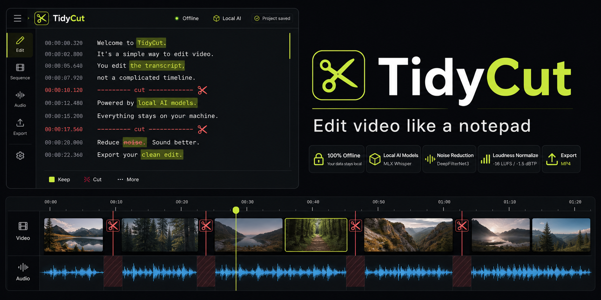

# TidyCut



AI-native video editing that still runs locally.

Drop in clips, transcribe them with local Whisper models, edit from the words
instead of the waveform, ask Claude for a first-pass scene edit, then render a
clean MP4 with FFmpeg.

## What It Does

- Local word-level transcription with MLX Whisper.
- Transcript-first editing: cut or restore words and pauses directly from text.
- AI edit planning: Claude reads timestamped transcript ranges and proposes a
  conservative scene sequence made from complete usable takes.
- Multi-clip sequencing: add clips, make copies from source media, reorder,
  split, trim, and restore timeline sections.
- Project persistence: autosaved edit projects, project drawer, rename,
  reopen, and delete.
- Timeline context: generated thumbnails and waveform previews for each source.
- Transcript copy panel for quickly exporting the current spoken script.
- Optional audio cleanup with DeepFilterNet denoise and loudness normalization.
- MP4 export and download through FFmpeg.

## AI-Native Features

TidyCut treats transcripts as structured edit data, not just captions. Each word
and pause has timing metadata, so AI edit can reason about complete scenes while
the renderer still uses deterministic source time ranges.

The AI edit flow:

1. Transcribe one or more clips locally.
2. Open settings and add an Anthropic API key, or provide one with
   `ANTHROPIC_API_KEY`.
3. Click `AI edit`.
4. TidyCut sends the visible transcript ranges, clip labels, trim bounds, and
   timing metadata to Claude.
5. Claude returns a structured edit plan with selected source ranges, removed
   ranges, confidence, scene type, and review warnings.
6. TidyCut applies the plan as timeline clips that can still be inspected,
   adjusted, split, reordered, or rendered manually.

Only the AI edit request goes to Anthropic. Uploaded media, generated
transcripts, projects, timeline assets, audio previews, and renders stay on your
machine.

## Run Locally

Requirements:

- Node.js 20+
- Python 3.11+
- FFmpeg on `PATH`
- macOS with Apple Silicon is recommended for MLX Whisper

```bash
npm install
python3 -m venv .venv
.venv/bin/python -m pip install -r requirements.txt
brew install ffmpeg
npm run dev
```

Open `http://localhost:5173`.

`npm run dev` builds the Vite frontend and serves the app plus API from one
local server.

## Configuration

Set environment variables in the shell before starting the app:

```bash
ANTHROPIC_API_KEY="sk-ant-..." \
ANTHROPIC_EDIT_MODEL="claude-opus-4-6" \
npm run dev
```

You can also save the Anthropic key from the in-app settings modal. Saved AI
settings are written locally to `projects/_settings/anthropic.json`, which is
ignored by git.

Useful environment variables:

```text
ANTHROPIC_API_KEY             Optional key for AI edit.
ANTHROPIC_EDIT_MODEL          Claude model for AI edit. Defaults to claude-opus-4-6.
LOCAL_EDITOR_MODEL            Default MLX Whisper model.
LOCAL_EDITOR_MODEL_CACHE      Hugging Face / MLX model cache directory.
LOCAL_EDITOR_PROJECTS         Project, render, settings, and asset storage root.
LOCAL_EDITOR_AI_EDIT_MAX_ITEMS Maximum transcript items sent to AI edit.
LOCAL_EDITOR_VAD              Set to 0 to disable voice activity chunking.
LOCAL_EDITOR_PYTHON           Python executable used by the backend.
```

The app also exposes these settings in the UI where practical:

- Default transcription model.
- Denoise and normalize export defaults.
- Anthropic API key status.
- AI edit model currently used by the backend.

## Transcription Models

The default model is:

```text
mlx-community/whisper-large-v3-turbo
```

Available in-app options include Whisper large v3 turbo, large v3, medium,
small, and tiny MLX variants. Models download to the local model cache on first
use.

## Optional Audio Cleanup

The export settings can enable:

- Denoise with DeepFilterNet3.
- Loudness normalization to `-16 LUFS` and `-1.5 dBTP`.

DeepFilterNet is optional. Install the separate audio requirements only if you
need denoise support:

```bash
.venv/bin/python -m pip install -r requirements-audio.txt
```

## Local Storage

By default, TidyCut stores local data here:

```text
projects/
models/
uploads/
dist/
```

Move projects and model caches to another drive with:

```bash
LOCAL_EDITOR_PROJECTS="/path/to/projects" \
LOCAL_EDITOR_MODEL_CACHE="/path/to/models/hf" \
npm run dev
```

Project data includes source references, canonical transcript JSON, autosaved
edit documents, timeline thumbnails, waveform previews, audio previews, local
AI settings, and renders.

## Development

```bash
npm run build
npm test
```

The test command runs the Node test suite and Python unit tests. Python tests
expect the virtual environment and `requirements.txt` dependencies to be
installed.
